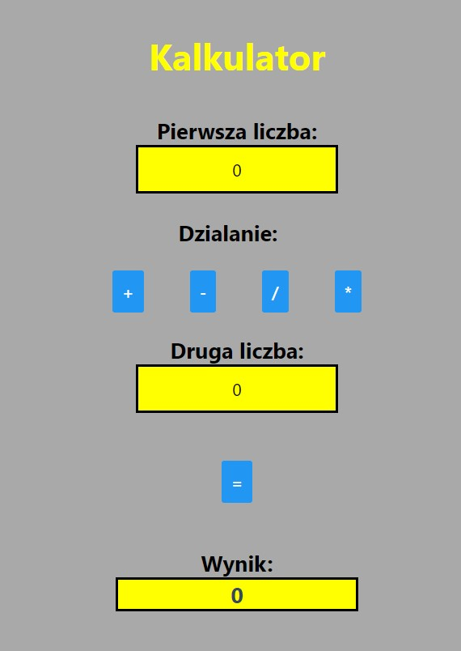
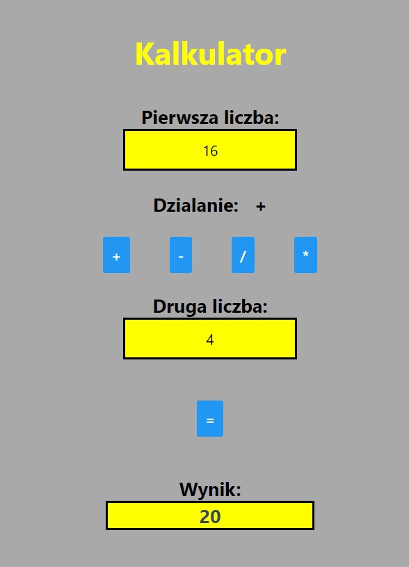
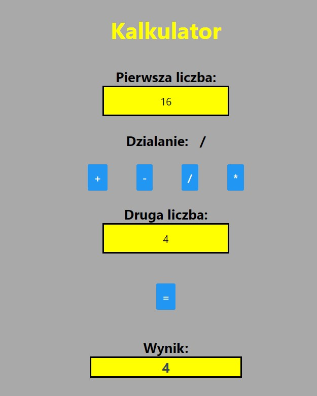
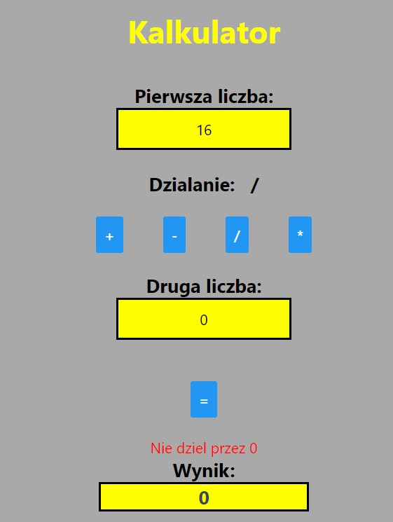

Lab. nr 1 - aplikacja startowa: kalkulator

- należy utworzyć repozytorium o nazwie aplikacje-mobilne-dane-nr_grupy, gdzie zamiast 'dane' pisujemy nazwisko lub nr indeksu; będzie ono podstawą zaliczenia przedmiotu,
- w ww. repozytorium umieszczamy kolejne zrealizowane zadania w osobnych folderach i z osobnymi plikami README.md,
- dokumentacja startowa dla React Native,
- dokumentacja startowa Android Developers,
- dokumentacja startowa dla Xamarin,
Poniższe zagadnienia powinny zostać zrealizowane:
- dla wybranej technologii: instalacja pakietów i tworzenie projektu, ustawienia projektu, korzystanie z serwera deweloperskiego,
- wykorzystanie podstawowych komponentów i API dla wybranej technologii, np. dla React Native,
- zapoznanie z komponentami dla wybranej technologii i ich użycie, np. dla React Native,
- w każdym z zadań można użyć Expo lub React Native CLI lub create-react-native-app,
- należy opisać w pliku README.md co zostało zrealizowane, za co odpowiada wybrany fragment kodu (komponent, funkcja lub klasa) oraz dołączyć zrzuty aplikacji (lub zdjęcia ekranu telefonu, jeśli nie uda się zrobić standardowego zrzutu).

Widok strony po uruchomieniu

Widok strony - wykonanie dodawania

Widok strony - wykonanie dzielenia

Widok strony - dzielenie przez 0 (wyświetlony błąd)
