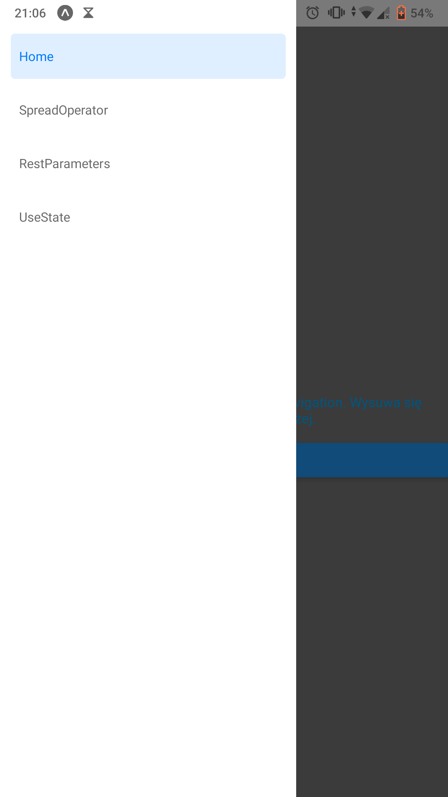
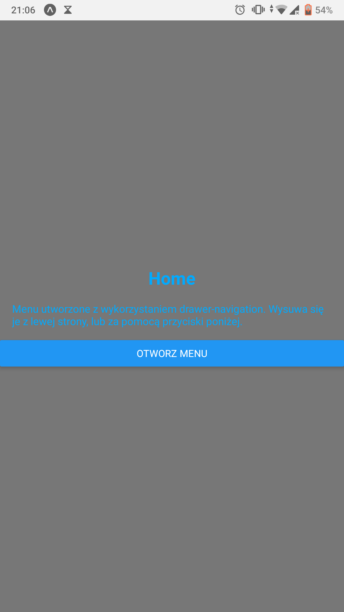
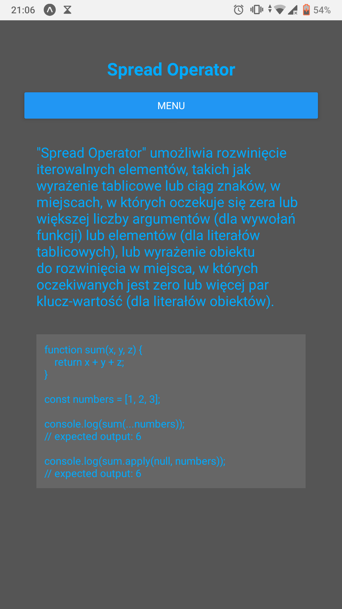
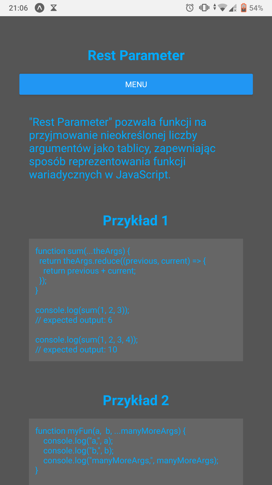
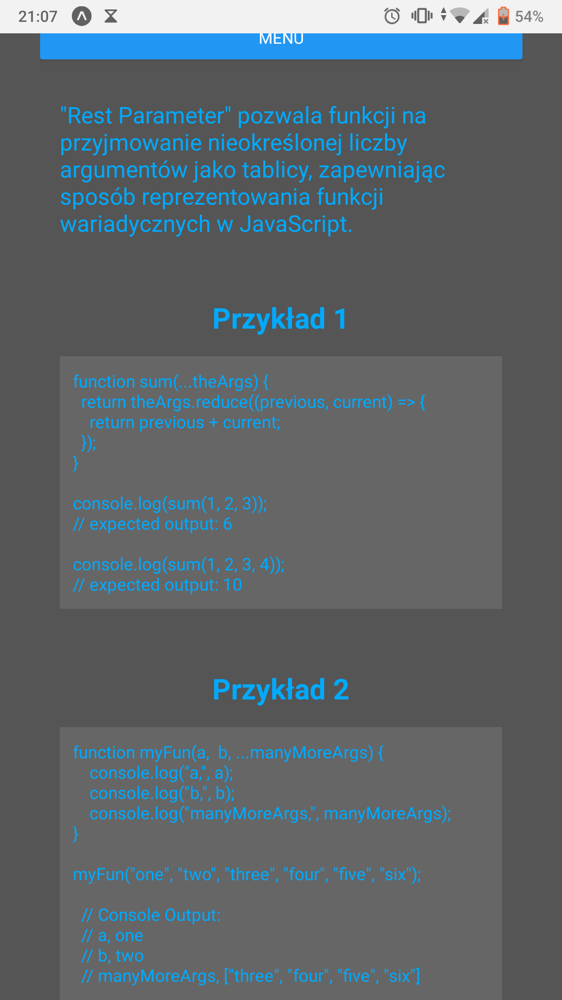
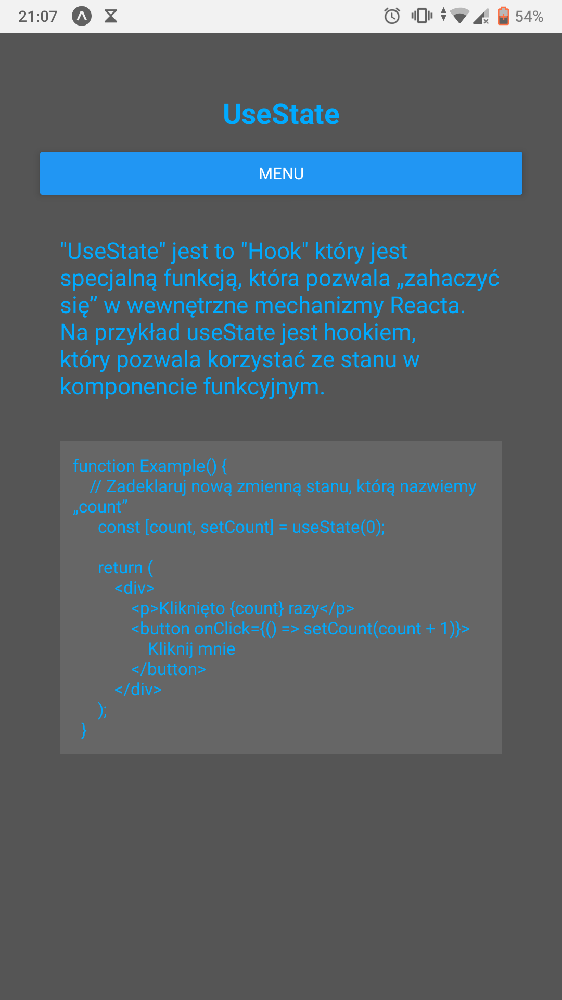

Lab. nr 2 - responsywne layouty + nawigacja

poniższe zagadnienia powinny zostać zrealizowane:
- należy utworzyć 3 ekrany za pomocą react-navigation,
- do przechodzenia między ekranami można użyć stack-navigator (wykorzystany drawer-navigation),
- na każdym ekranie powinny się znaleźć przyciski pozwalające przejść do dwóch pozostałych ekranów,
- każdy ekran powinien byc "ostylowany" w innym stylu niż pozostałe ekrany, z wykorzystaniem Flexboxa (m.in. poprzez moduły StyleSheet i Platform),
- style należy utworzyć w pliku styles.js i zaimportować w odpowiednim miejscu,
- należy umieścić na ww. ekranach informacje, czym jest spread operator, czym są rest parameters oraz do czego służy 'hook' useState,

Do przechodzenia między ekranami wykorzystany został drawer-navigation, który rozwija się z lewej strony i można w nim wybrać ekran na który chcemy się przełączyć.

Widok nawigacji wykonanej przy pomocy drawer-navigation

Widok strony "Home"

Widok strony "Spread Operator"

Widok strony "Rest Parameters"

Widok strony "Rest Parameters" (dół strony)

Widok strony "UseState"

