# Lab. nr 4 - obsługa danych wprowadzanych przez użytkownika + modale

### do działania należy uruchomić:
- npm install @react-navigation/native
- npm install @react-navigation/drawer
- expo install react-native-gesture-handler react-native-reanimated react-native-screens react-native-safe-area-context @react-native-community/masked-view
- npm install @react-native-picker/picker
- npm install @react-native-community/datetimepicker

### Zadanie wykorzystuje:
- komponentem TextInput w React Native,
- obsługą komponentu TextInput w React Native,
- obsługą komponentu DatePicker w React Native,
- obsługą komponentu Picker w React Native,
- obsługą komponentu Switch w React Native,
- obsługą komponentu Modal w React Native,
- obsługą komponentu Alert w React Native,
- dokumentacją ToastAndroid API w RN.

### Zagadnienia do zrealizowania:
- wskazane użycie kodu z lab. nr 2, po to żeby mieć kilka ekranów 🌞
- na pierwszym ekranie należy zaimplementować "przegląd" możliwości komponentu 'TextInput'; należy wykorzystać odpowiednie propsy i/lub stan danego komponentu.
- na drugim ekranie należy zaimplementować obsługę co najmniej dwóch komponentów 'Select'; niech zmiana w jednym selektorze powoduje zmiany w pozostałych selektorach; można pokusić się o pobieranie danych do selektorów z wybranych API (np. z ćwiczeń dotyczących asynchronicznego Javascript).
- na trzecim ekranie należy zaimplementować obsługę przełącznika 'Switch', tak aby po zmianie jego położenia pojawiał się modal z pseudolosową liczbą.
- na czwartym ekranie należy zaimplementować wybór daty i czasu; po wciśnięciu przycisku 'Wyświetl termin' powinien pojawić się alert z wybranymi parametrami czasowymi.
- na piątym ekranie należy zaimplementować "aktywny" modal + pasywne powiadomienia za pomocą ToastAndroid (lub jego odpowiednika w iOS); można wykorzystać funkcję setTimeout() na czas trwania obietnicy (Promise) i w tym czasie powinien być aktywny modal; ww. powiadomienie powinno się pojawić po rozwiązaniu obietnicy (resolve of Promise object).

### Widok nawigacji wykonanej przy pomocy drawer-navigation (rozbudowa aplikacji z Lab2, dodane nowe podstrony)
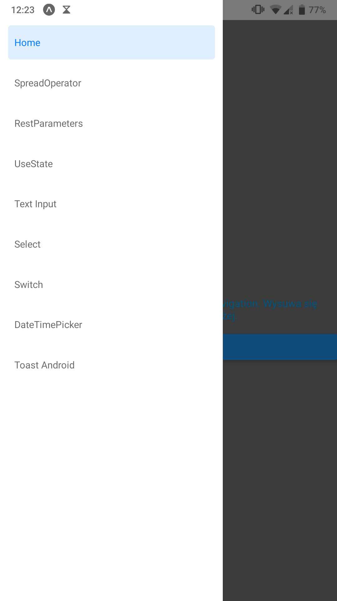

### Widok elementu TextInput wraz z ustawionymi różnymi parametrami
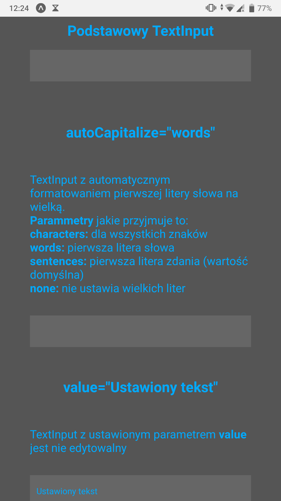
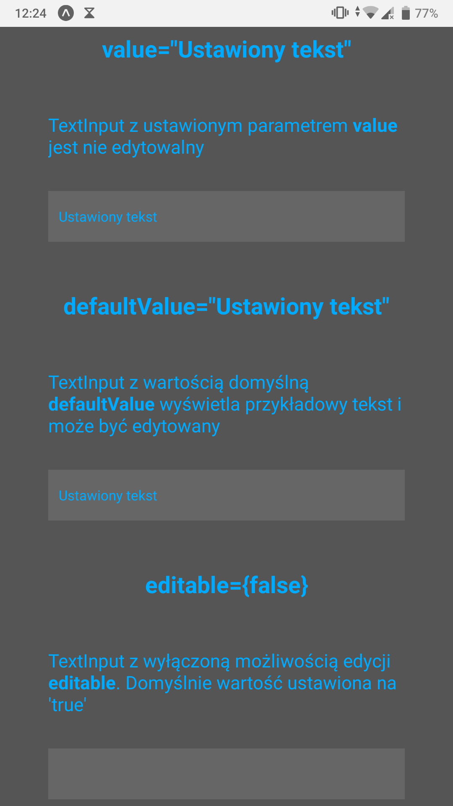
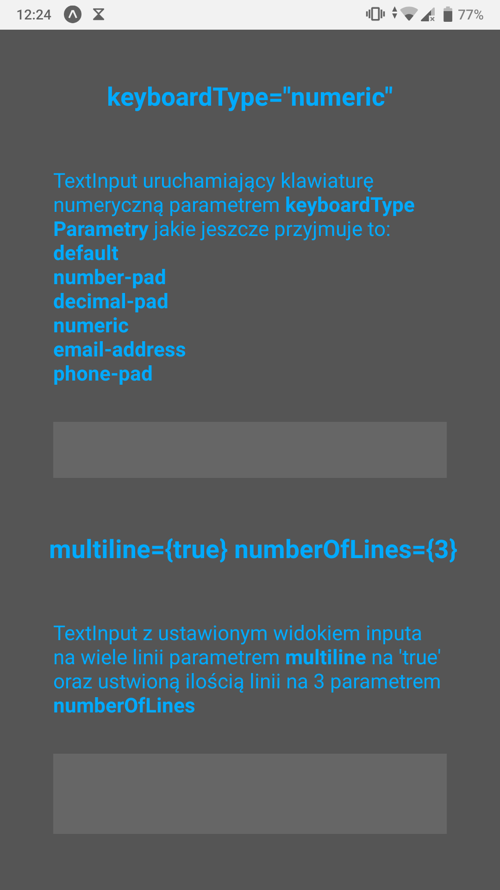
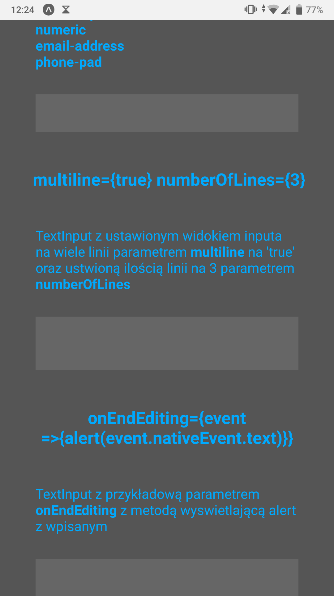

### Widok elementu Select wraz z ustawionymi różnymi parametrami
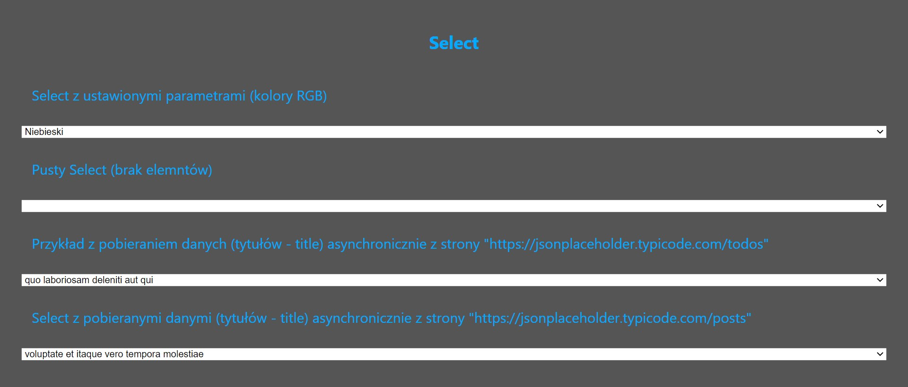

### Widok elementu Switch który losuje liczbę z zakresu 1-1000
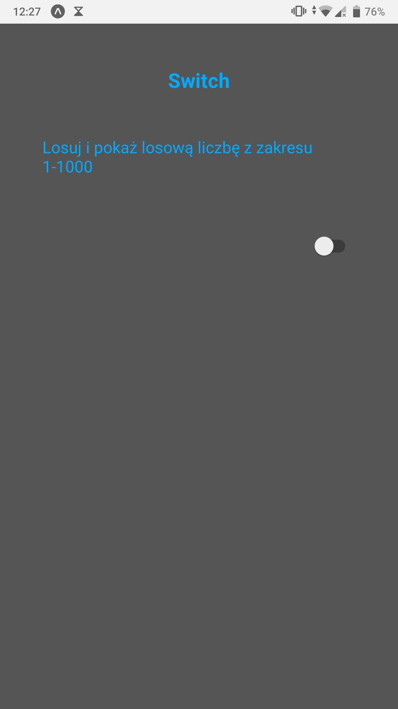
### Wynik uruchomienia Switcha

 
### Widok elementu DateTimePicker którym możemy ustawić datę i godzinę, a następnie wyświetlić ustawione parametry
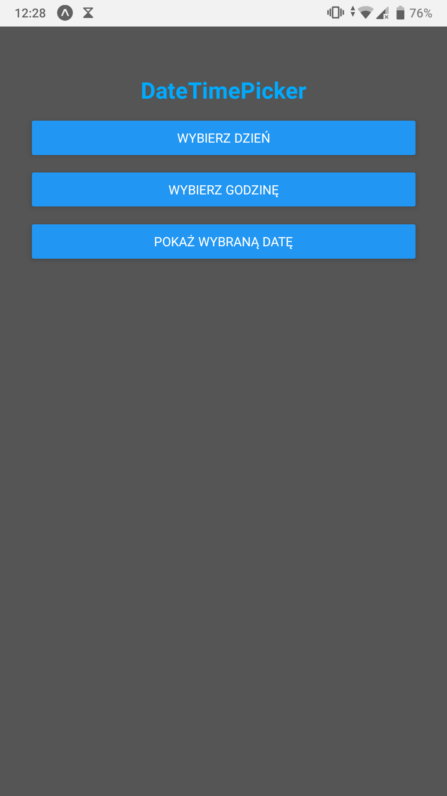
### Wybór daty
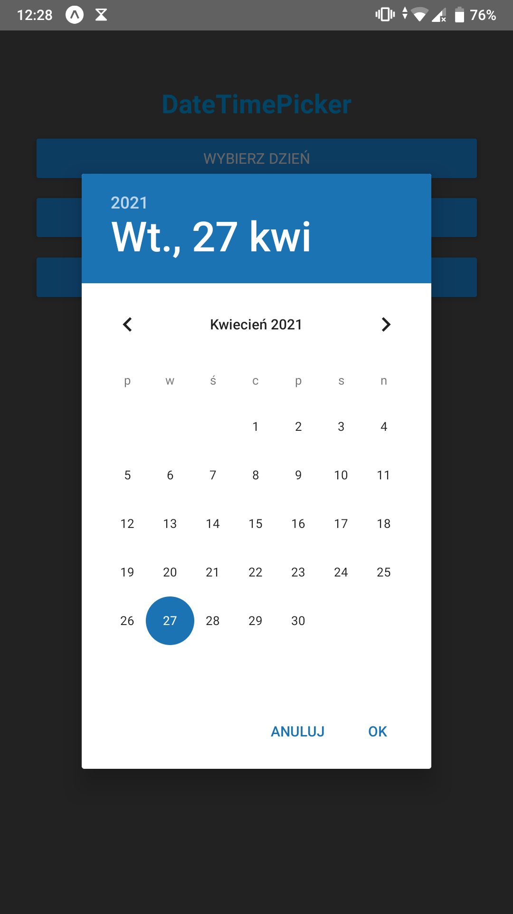
### Wybór godziny i minuty
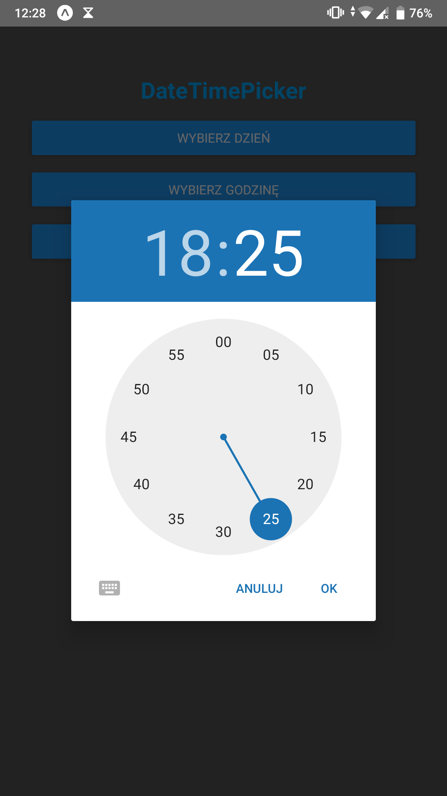
### Wyświetlenie wybranych parametrów
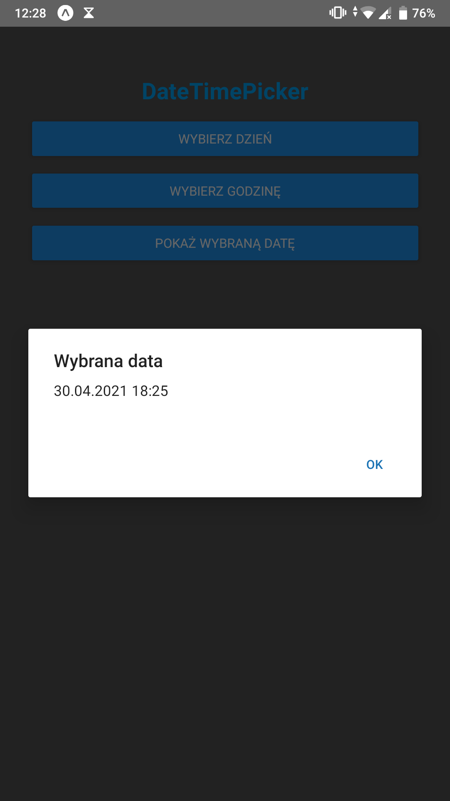

### Widok elementu ToastAndroid któy losuje czas między 1-6 sekund, wyświetla wylosowany czas i wraca do ekranu gdzie można ponownie uruchomić funkcję

### Wylosowany czas wraz z powiadomieniem

