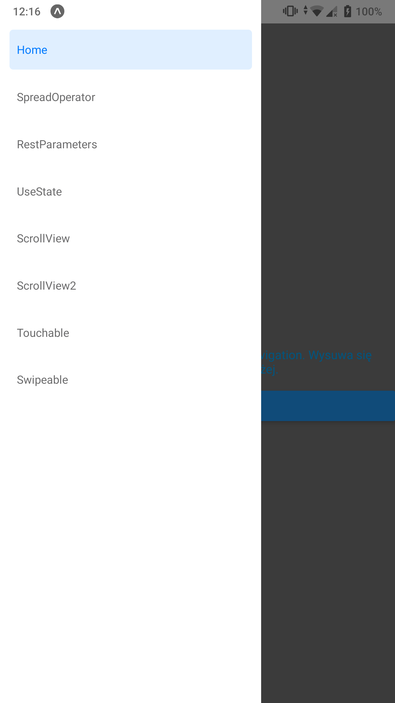
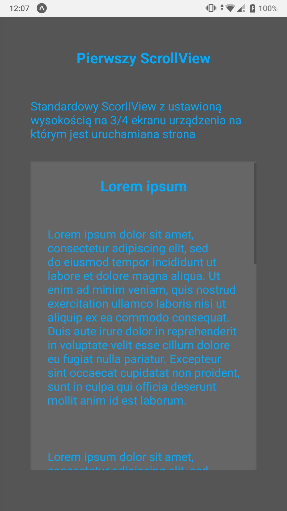
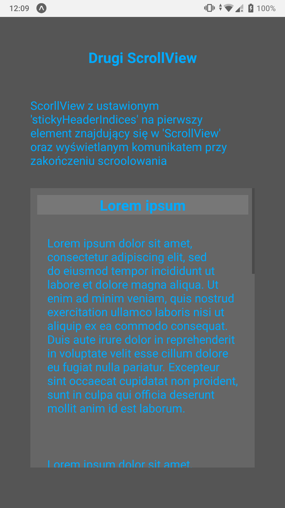
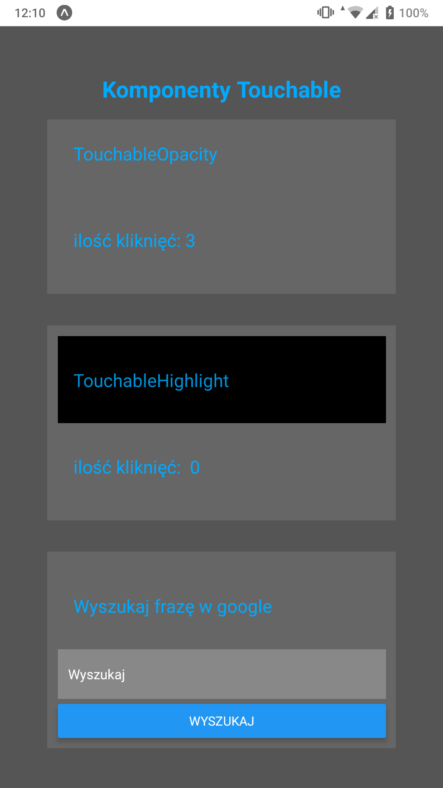
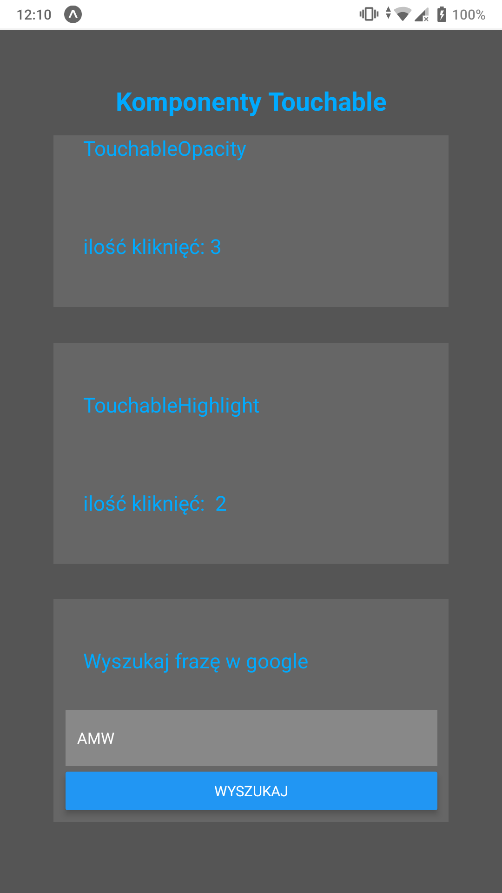
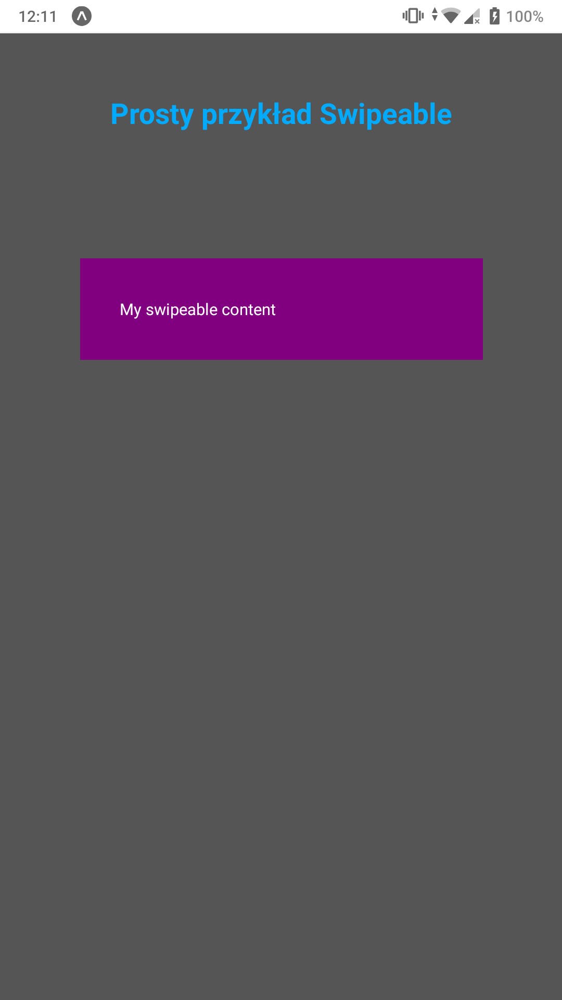
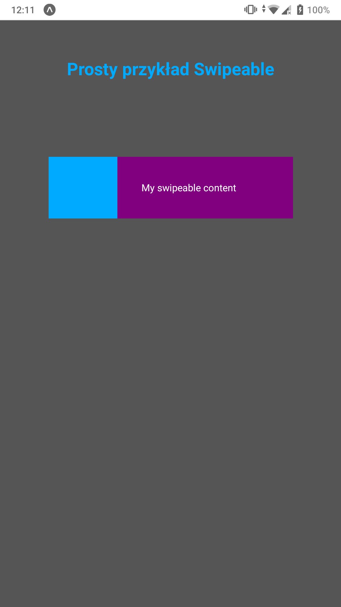
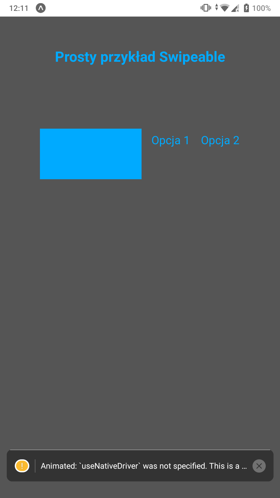
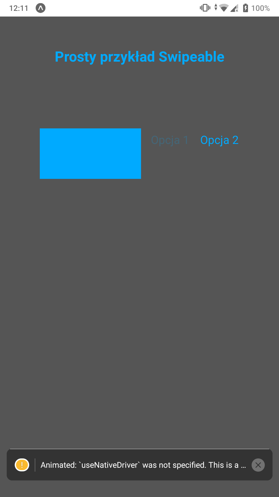

### Lab. nr 5 - obsługa gestów użytkownika

### do działania należy uruchomić:
- npm install @react-navigation/native
- npm install @react-navigation/drawer
- expo install react-native-gesture-handler react-native-reanimated react-native-screens react-native-safe-area-context @react-native-community/masked-view
- npm install react-native-webview
- npm install react-native-paper
- npm install react-native-swipeable

#### Zadanie wykorzystuje:
- Gesture Responder System w React Native,
- obsługą komponentu ScrollView w React Native,
- metodą fill(),
- obsługą komponentu TouchableOpacity w React Native,
- obsługą komponentu Pressable w React Native,
- obsługą komponentu TouchableHighlight w React Native,
- obsługą komponentu Swipeable w React Native,

### Zagadnienia do zrealizowania:
- wskazane użycie kodu z lab. nr 2, po to żeby mieć kilka ekranów 🌞
- na pierwszym i na drugim ekranie należy zaimplementować użycie komponentu ScrollView, na każdym z nich powinnny być różne style (Flexbox) oraz widoczny pasek przewijania (scrollbar)
- na trzecim ekranie należy zaimplementować użycie komponentów TouchableOpacity i TouchableHighlight; na ➕ można pokusić się o użycie komponentu WebView po naciśnięciu przycisku,
- na czwartym ekranie należy zaimplementować obsługę przesunięć palcem (komponent Swipeable);
- ➕ za modyfikacje kodu (tak, by były inne niż te w przykładach) i za dodatkowe ekrany (np. druga wersja z komponentem Swipeable lub użycie komponentu Pressable).

### Widok nawigacji wykonanej przy pomocy drawer-navigation (rozbudowa aplikacji z Lab2, dodane nowe podstrony)

### Widok standardowego elementu ScrollView

### Widok elementu ScrollView z ustawionymi parametrami 'stickyHeaderIndices' oraz 'onScrollEndDrag'

### Widok standardowego elementu TouchableOpacity

### Widok standardowego elementu TouchableHighlight

### Widok wyszukiwania frazy z wykorzystaniem elementu WebView w wyszukiwarce google

### Wynik wyszukiwania frazy AMW

### Widok elementu Swipeable z ustawionymi parametrami:
- 'leftActionActivationDistance' -> dystans przeciągnięcia po jakim następuje aktywacja
- 'leftContent' -> wyświetlane informacje na lewym pasku
- 'onLeftActionActivate' -> funkcja wywoływana przy aktywacji lewego przeciągnięcia
- 'onLeftActionDeactivate' -> funkcja wywoływana przy deaktywacji lewego przeciągnięcia (kolejne przeciągnięcie po poprawnym wykonaniu pierwszego)
- 'onLeftActionComplete' -> funkcja ustawiająca wartości na stronie po zakończeniu akcji przeciągania (aktywacji lub deaktywacji)
- 'rightButtons' -> definiuje przyciski któe pojawiają się z prawego przeciągnięcia (w tym wypadku wykorzystany został element 'TouchableOpacity', a nie 'Button')

### Widok elementu 'Swipeable'

### Widok lewego przeciągnięcia

### Widok prawego przeciągnięcia

### Widok prawego przeciągnięcia z możliwością kliknięca w opcje 'Opcja1' (widok przyciskanego elementu) i 'Opcja2' (widok normalny)

