### Lab. nr 6 - obsługa obrazów + tryb offline

### do działania należy uruchomić:
- npm install @react-navigation/native
- npm install @react-navigation/drawer
- expo install react-native-gesture-handler react-native-reanimated react-native-screens react-native-safe-area-context @react-native-community/masked-view
- npm install @react-native-community/slider
- npm install @react-native-community/netinfo
- npm install @react-native-async-storage/async-storage

#### Zadanie wykorzystuje:
- obsługą komponentu Image w React Native,
- obsługą komponentu NetInfo w React Native,
- obsługą komponentu Slider w React Native,
- zastosowaniem ikon w React Native,
- zastosowaniem ikon w Expo,
- obsługą komponentu/modułu AsyncStorage w React Native.

### Zagadnienia do zrealizowania:
- wskazane użycie kodu z lab. nr 2, po to żeby mieć kilka ekranów 🌞
- na pierwszym ekranie należy zaimplementować ładowanie dwóch obrazków (komponent Image) - pierwszy za pomocą właściwości 'uri', a drugi z użyciem metody require(),
- na drugim ekranie należy zaimplementować zmianę rozmiaru ładowanego obrazka za pomocą komponentu Slider, (można też na pierwszym ekranie załadować jeden obrazek ze sliderem i na drugim ekranie podobnie),
- na trzecim ekranie należy zaimplementować 'leniwe' ładowanie obrazka oraz renderowanie wybranego zestawu ikon,
- na kolejnym ekranie należy zaimplementować detekcję łączności z siecią i wyświetlić odpowiednią informację,
- na kolejnym ekranie należy zaimplementować obsługę zapisu danych aplikacji za pomocą AsyncStorage,
- na ostatnim ekranie należy zaimplementować obsługę synchronizacji danych aplikacji (np. stanu wybranych elementów), w przypadkach łączności z siecią i jej braku,

### Widok nawigacji wykonanej przy pomocy drawer-navigation (rozbudowa aplikacji z Lab2, dodane nowe podstrony)
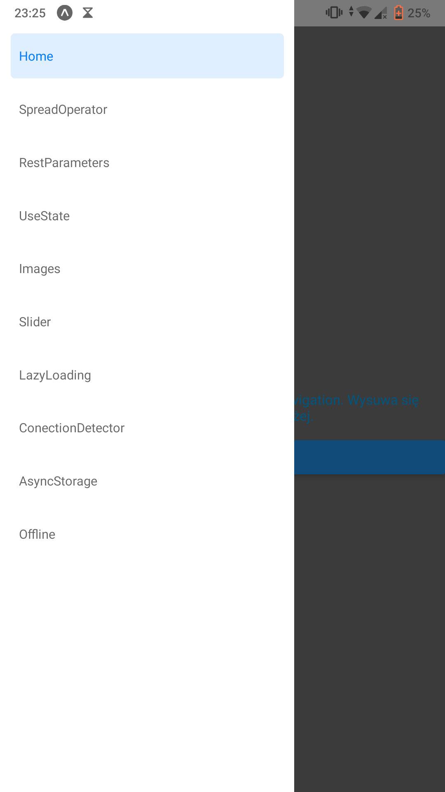

### Widok podstrony Images z ładowaniem 2 obrazków za pomocą właściwości 'uri'oraz z użyciem metody require()
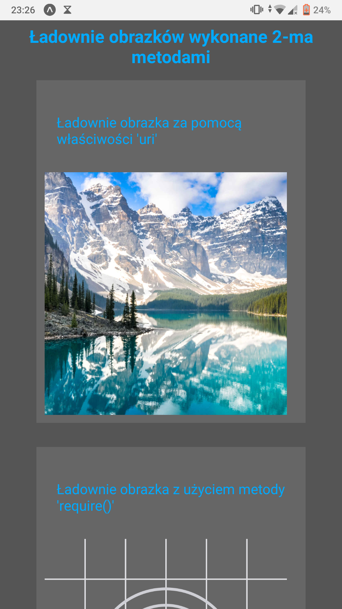

### Widok podstrony Slider z zmianą rozmiaru ładowanego obrazka za pomocą komponentu
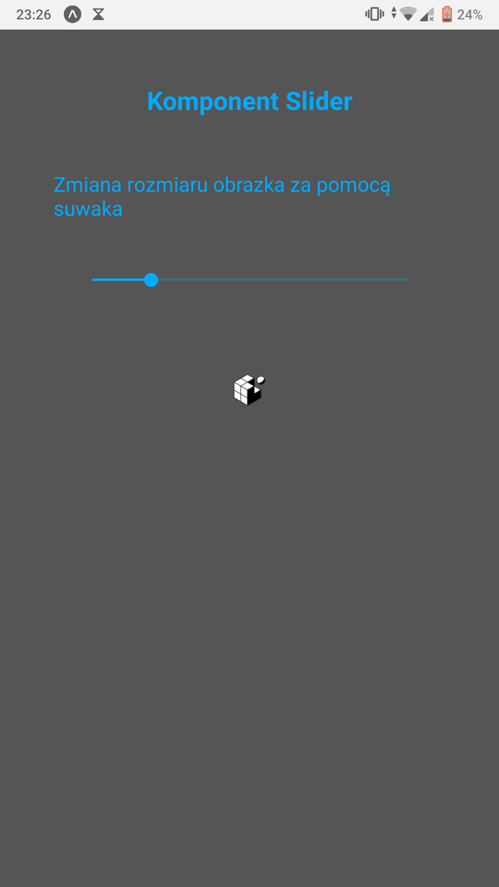
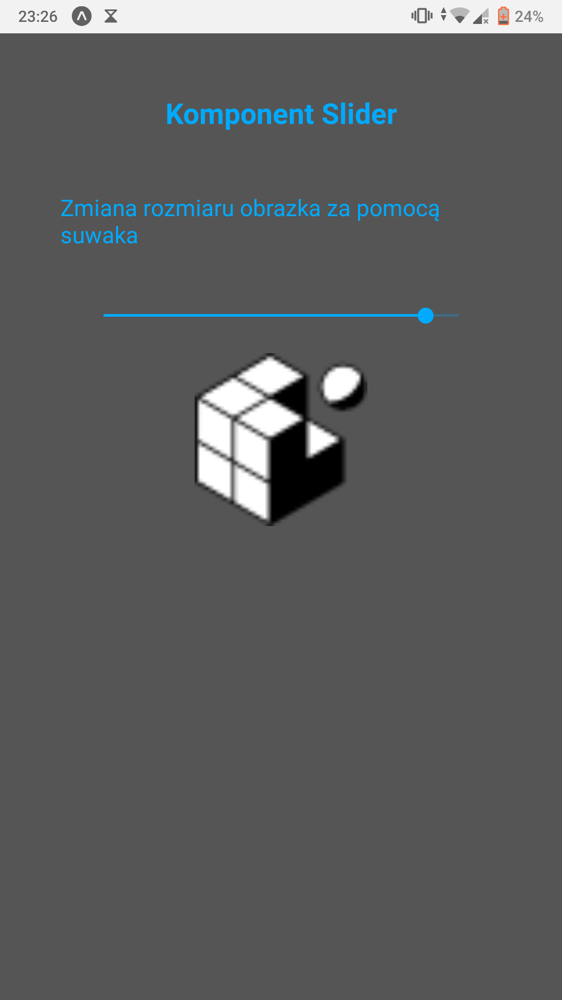

### Widok podstrony LazyLoading z leniwym ładowaniem obrazka oraz renderowaniem wybranego zestawu ikon (strzałki z AntDesign)
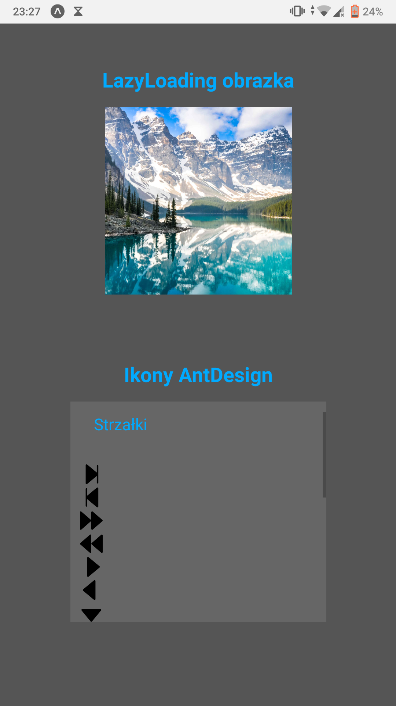

### Widok podstrony ConnectDetection z detekcją łączności z siecią i wyświetlaniem informacji o połączeniu i sieci
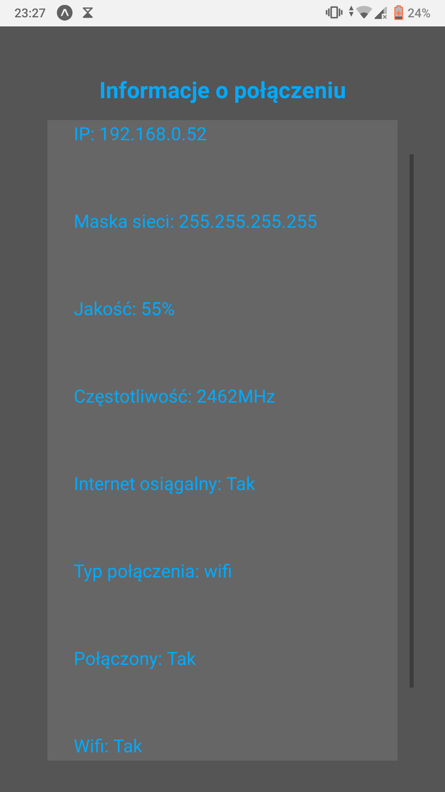

### Widok podstrony AsyncStorage z obsługą zapisu danych aplikacji (na slajdach przedstawiono kolejne kroki działania)
#### Widok ogólny strony
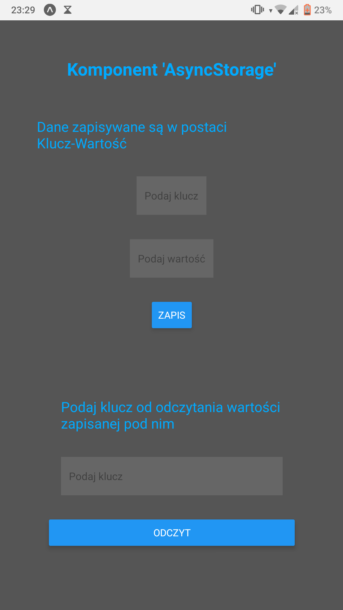
#### Widok wprowadzania danych
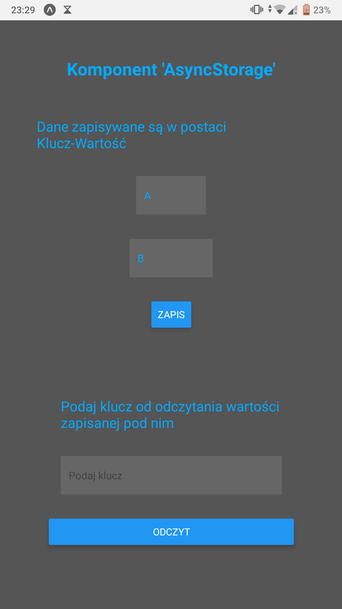
#### Widok komunikatu o wprowadzeniu danych

#### Widok wprowadzenia klucza do odczytu danych
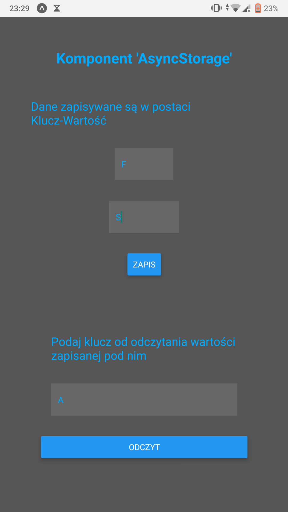
#### Widok komunikatu o odczycie danych (w przypadku braku danych wyświetla informację "Brak elementu")
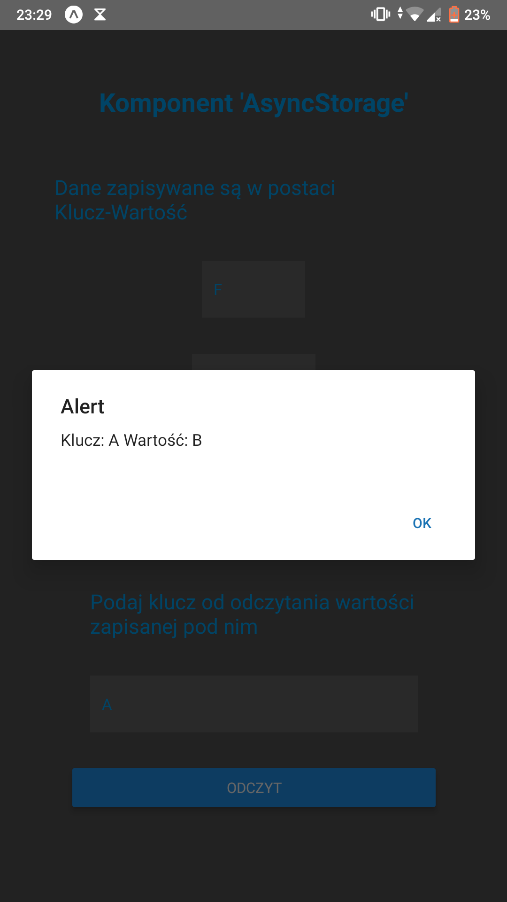

### Widok podstrony Offline z obsługę synchronizacji danych aplikacji w przypadkach łączności z siecią i jej braku
#### Widok ogólny strony
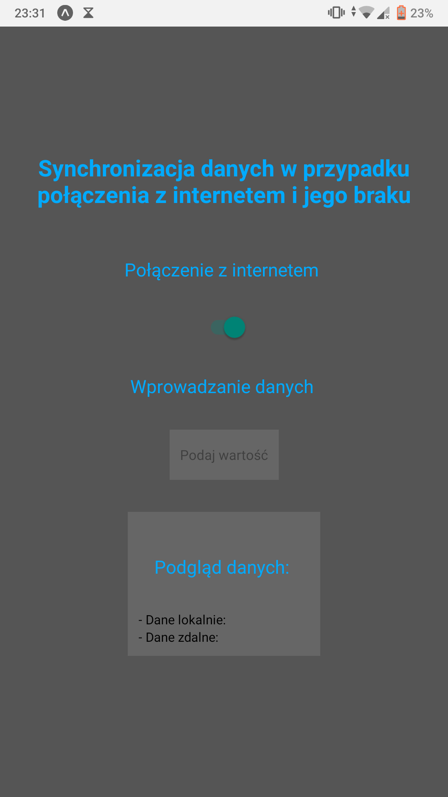
#### Widok wprowadzenia danych ( Litery "D" )
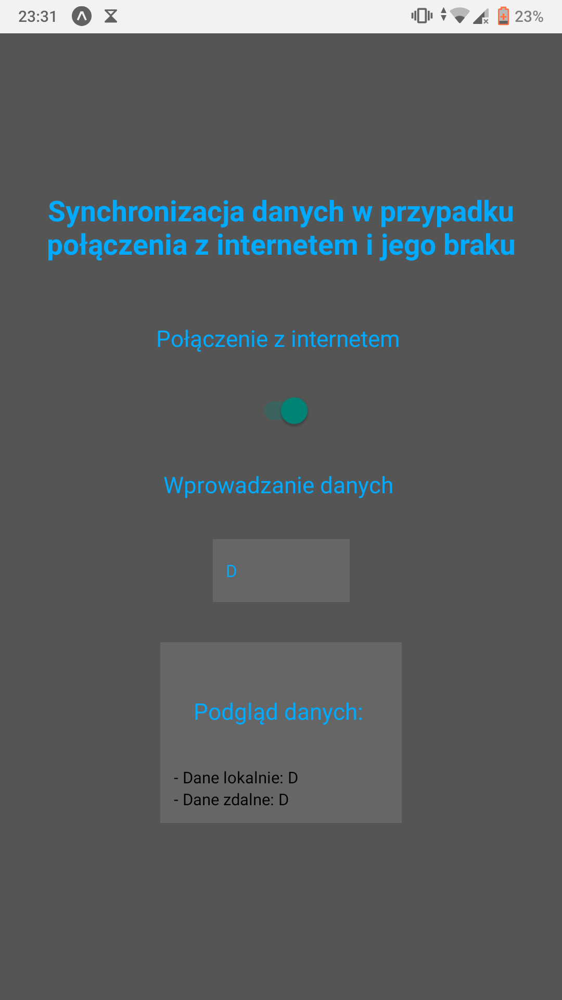
#### Widok wyłączenia połączenia z internetem (symulowanie utracenia połączenia) oraz wprowadzenie danych "Dominik". Brak zmiany danej zdalnej
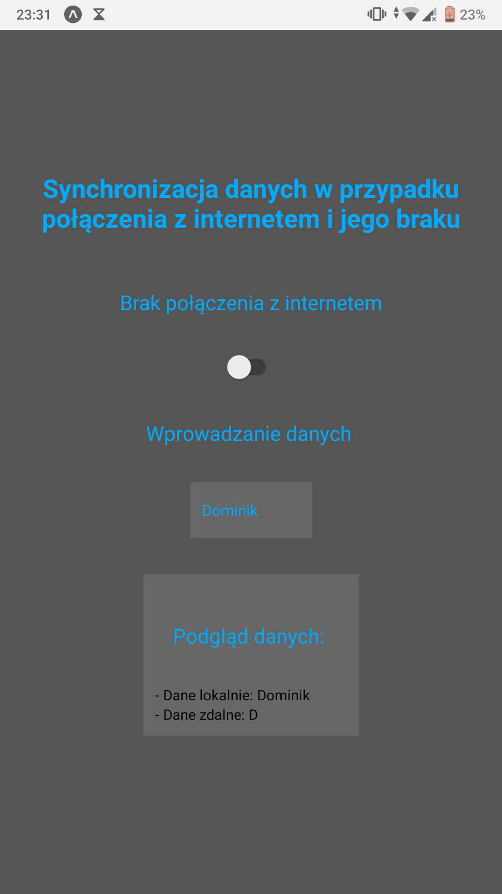
#### Widok "odblokowania" połączenia z internetem i aktualizacja danych zdalnych
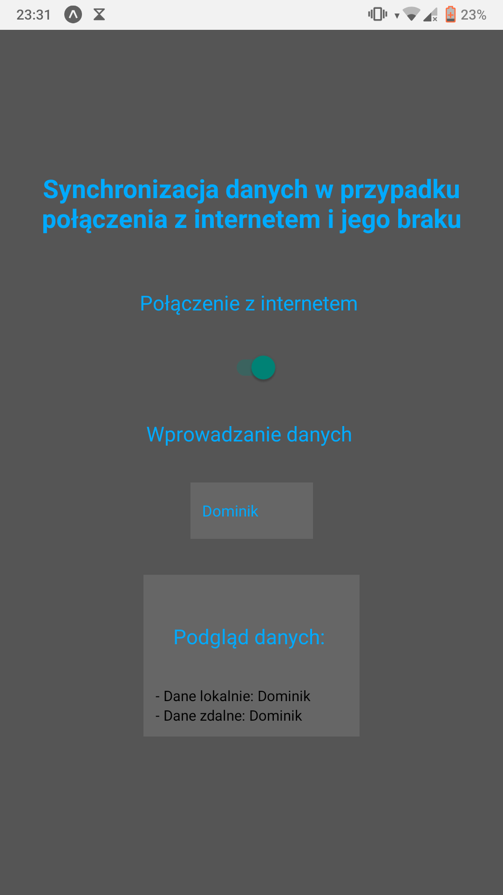