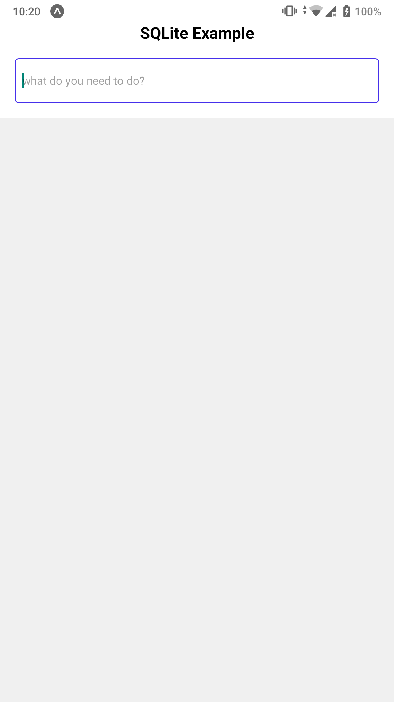
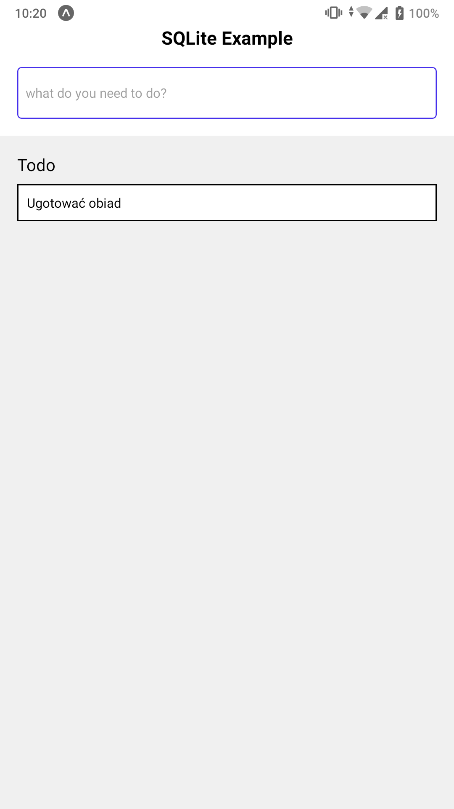
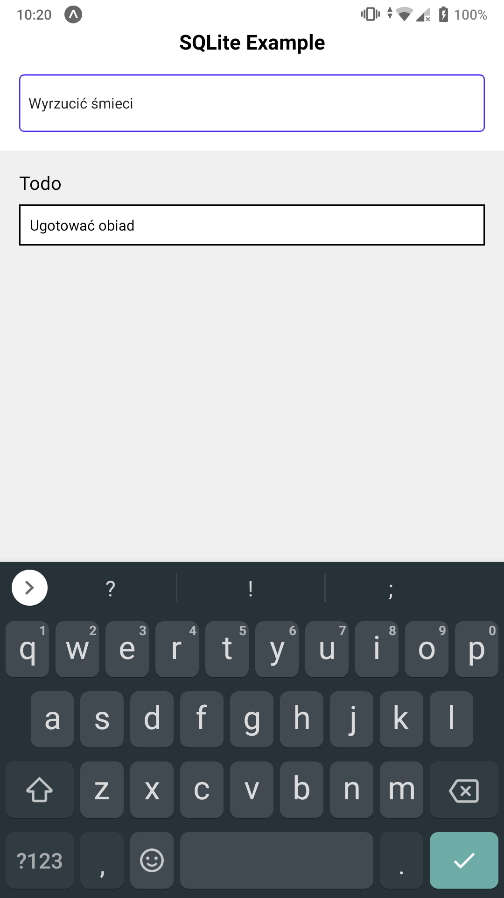
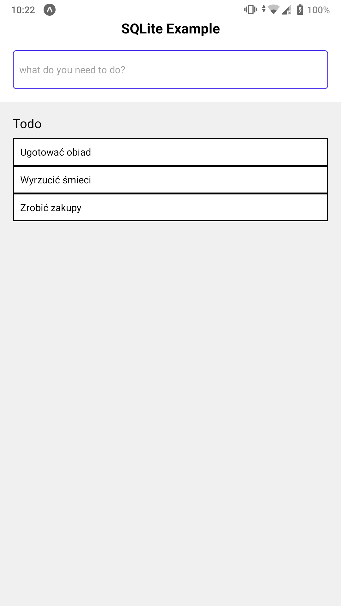
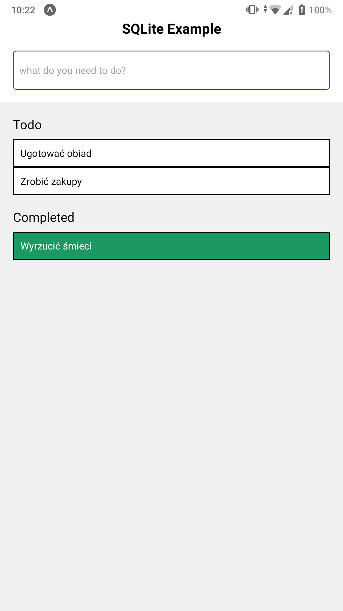
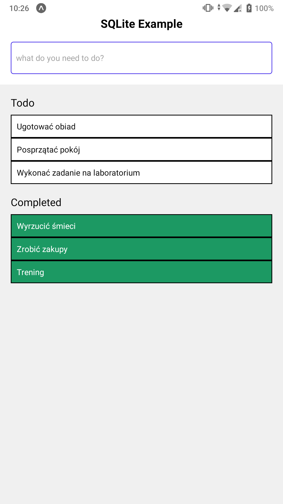
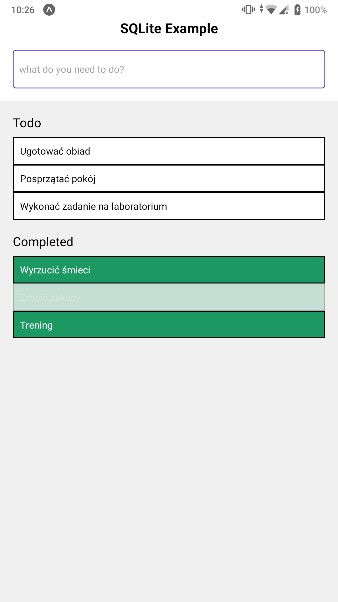
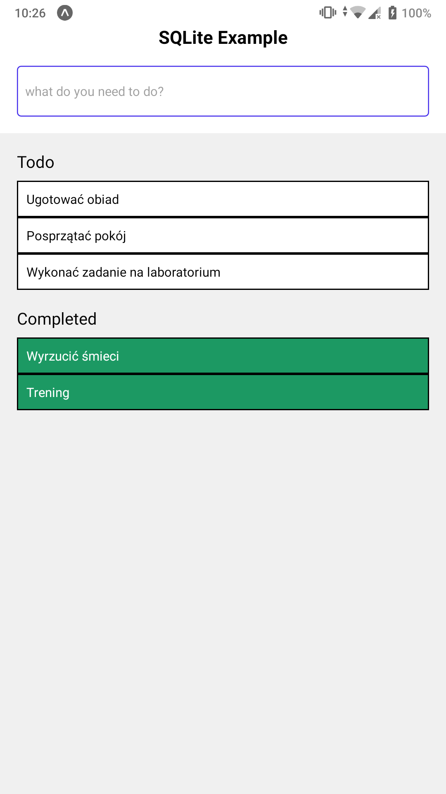
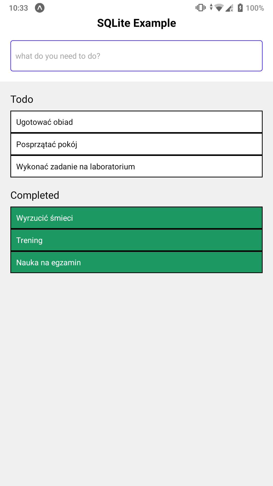
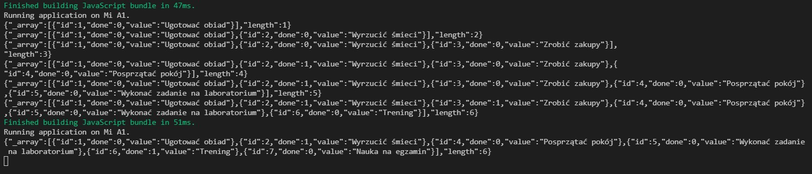

### Lab. nr 7 - wykorzystanie bazy danych w aplikacji mobilnej

### do działania należy uruchomić:
- npm install @react-navigation/native
- npm install @react-navigation/drawer
- expo install react-native-gesture-handler react-native-reanimated react-native-screens react-native-safe-area-context @react-native-community/masked-view
- npm install react-native-sqlite-storage
- expo install expo-sqlite

#### Zadanie wykorzystuje:
- dostęp do bazy SQLite z wykorzystaniem Expo,
- użycie modułu react-native-sqlite-storage dla bazy SQLite tworzonej w momencie uruchomienia aplikacji,
- przykłady użycia zapytań do bazy SQLite w aplikacji React Native,
- użycie modułu react-native-sqlite-storage dla istniejącej bazy SQLite,
- informacje nt. lokalnych baz danych w React Native,
- aplikacja do obsługi bazy SQLite,
- dokumentacją mobilnej baza danych Realm, oferującej większe możliwości niż SQLite,
- przykład (na repo przedmiotowym) z bazą SQLite tworzoną w momencie uruchomienia ,
- użycie bazy Realm w aplikacji z React Native,
- dokumentacja modułu react-native-sqlite-storage.

### Zagadnienia do zrealizowania:
- możliwe użycie kodu z lab. nr 2, po to żeby mieć kilka ekranów 🌞
- należy zaimplementować użycie bazy danych (SQLite lub innej) w dwóch wariantach, opisanych poniżej,
- w pierwszym wariancie tworzymy bazę w momencie uruchomienia aplikacji, a w drugim korzystamy z bazy danych już istniejącej
- można ww. warianty zrealizować w jednej aplikacji na osobnych ekranach lub stworzyć dwie osobne aplikacje,
- dane w bazie danych zależą od twórcy aplikacji,

### Widok strony splikacji ToDo

### Dodawanie zadań odbywa się poprzez wpisanie (w komponent TextInput) zadania i zatwierdzenie go przyciskiem "ENTER"
#### Dodanie kilku zadań

### Update danych w bazie polega na kliknięciu w wybrane zadanie (status zadania zmienia się z "ToDo" na "Completed")

### Dodanie oraz Update kilki kolejnych zadań

### Usuwanie elementów (możliwe tylko na elementach z statusem "Completed") odbywa się przez naciśnięcie na dane zadanie które jest już ukończone

### Po zrestartowaniu zadania możemy zobaczyć wszystkie zadania które wcześniej dodaliśmy oraz dodać i update'ować kolejne zadanie "Nauka na egzamin". Dzięki połączeniu z BD nie straciliśmy poprzednio dodanych zadań

### Na koniec możemy zobaczyć w konsoli że mimo ponownego buildowania aplikacji działaliśmy cały czas na tej samej bazie danych
#### Wyświetlany w konsoli wynik zapytania "select * from items" po każdym dodaniu elementu lub update'cie elementów

